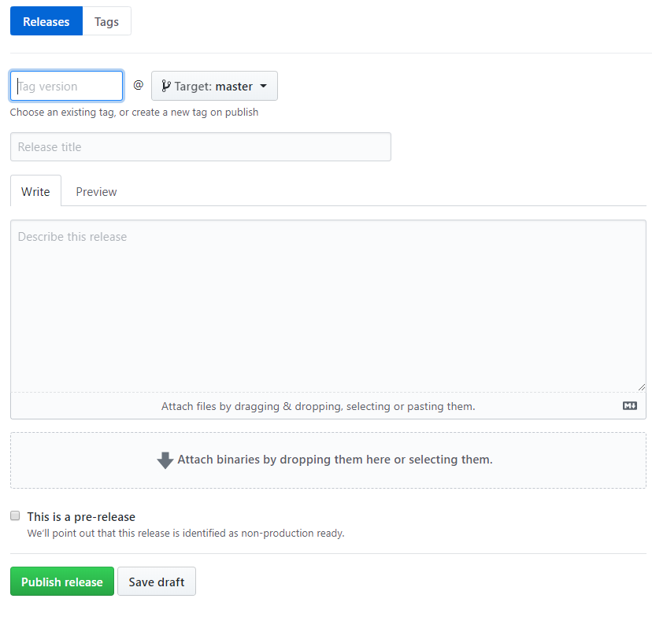

## Update database

Check migration files existing in `app/migrations/`, create one following the pattern accordingly making sure to check if the changes aren't already made.
Also don't forget to update the models definition. 

Then add your file to the array in `app/migrations/migrate.js` like so
```typescript
const migrations = {
    1: migration1,
    2: migration2,
    3: migration3,
    4: migration4,
    5: migration5, // <-- new migration would be migration6
};
```
the migrations will be executed by calling the function `migrateDatabase()` present in `app/migrations/migrate.js`

## Publish update

Create a release on github, with a tag version like v{version} (v1.0) if version is 1.0. Add a title, a description and save it as draft.



Don't forget to update the package.json' version according to the tag version you just created

```typescript
"version": "1.0"
```

Now push your changes to master

```bash
$ git push origin master
```

then package your app, it should be published automatically
```bash
$ yarn package-win
```

Then go back to your github release draft and publish it.
